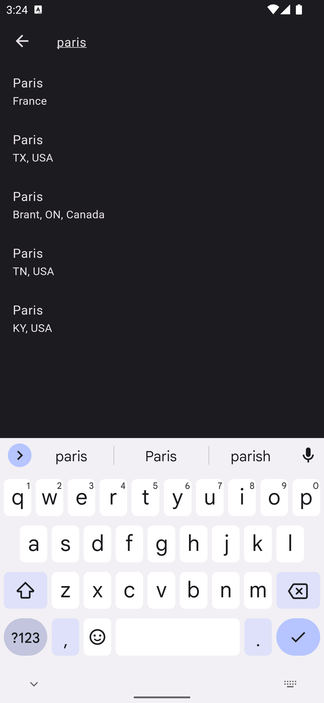
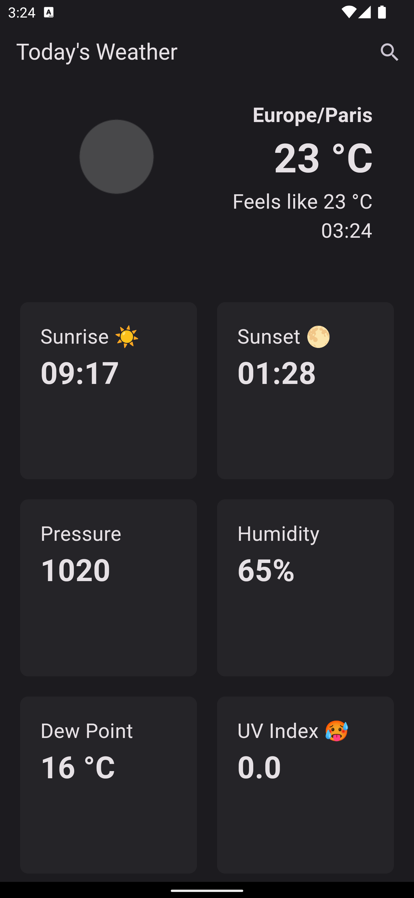

# Weather App ☀️ 🌕 ⛈️

## Todo

- [x] Build Everything without 3rd party state management
- [x] Build Everything using Provider
- [ ] Build Everything using BLoC
- [ ] Build Everything using Riverpod

Things to Learn

- [x] Debouncing
- [x] Search
- [x] Adding Google Places and Google Geocoding APIs
- [x] Adding OpenWeatherAPI api

## Preview

